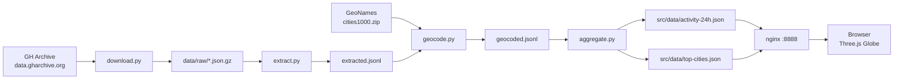
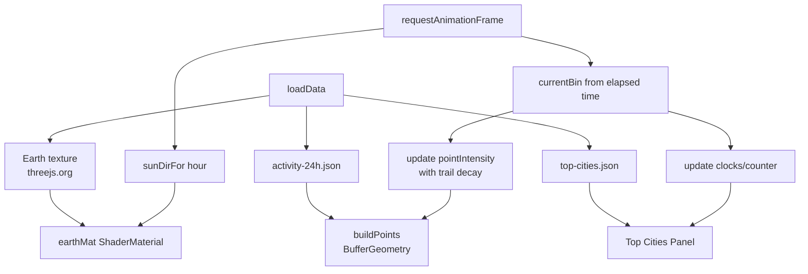

# アーキテクチャ

## ディレクトリ構成

```text
coders-follow-the-sun/
├── PROMPT.md, README.md, CONVERSATION.md
├── Dockerfile, docker-compose.yml, nginx.conf, .gitignore
├── doc/
│   └── architecture.md
├── scripts/
│   ├── download.py      # GH Archive 取得
│   ├── extract.py       # location 付きイベント抽出
│   ├── geocode.py       # cities1000 でジオコード
│   └── aggregate.py     # 24h × spatial ビン化
├── data/                # 中間データ (git ignore)
│   ├── cities1000.txt
│   ├── raw/             # GH Archive 元データ
│   ├── extracted.jsonl
│   ├── geocoded.jsonl
│   └── location-map.json
└── src/
    ├── index.html
    ├── main.js
    └── data/
        ├── activity-24h.json
        └── top-cities.json
```

## 使用ライブラリ

| ライブラリ | 用途 | 配信 |
|-----------|-----|-----|
| Three.js 0.160 | 3D地球儀レンダリング | unpkg CDN |
| Python標準 (urllib, gzip, json) | データ取得・前処理 | local |
| GeoNames cities1000 | 都市名 → 緯度経度ガゼッタ | 静的ファイル |
| nginx alpine | 静的配信 | Docker |

## コンテナレベル データフロー



## モジュールレベル データフロー（フロント）



## データ規模（実測値はパイプライン実行後に追記）

- 元データ: 2012-2014 各6/14〜6/27、1日24ファイル = 1,008ファイル、約1-2GB圧縮
- location 付きイベント率: 約46-50%（年により変動）
- ジオコード後の有効イベント: 約400-500万件想定
- 配信用 activity-24h.json: 1-5MB（144タイムビン × 緯度経度1度グリッド）

## 描画ループ

- 1日24時間 = 30秒で1ループ
- 各フレームで `dayFraction` から `currentBin` を導出
- 直近6ビン（60分相当）を残光として加算
- すべての地点について `intensity *= 0.9` の指数減衰
- 太陽位置（夏至基準デクリネーション +23.44°）を更新しシェーダーへ
